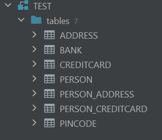

# DAT250: Software Technology Experiment Assignment 2

I did complete experiment 2, but due to some issues I had with git I lost my first project and only continued on experiment 2 when starting fresh.

Working with JPA was not too troublesome, although I encountered some unexpected behaviour with how the relationships between entities were represented in the database. For example when creating the Many To Many relationship between Person and Address, 2 join tables were initially created. This was fixed by adding the **@JoinTable** annotation in the **Person** class.

The biggest problem I had during the project was with connecting to and viewing the database in conjuction to running the program and creating the tables/inserting entities. I followed the video guide on how to connect to the derby database, which worked fine, and I was able to inspect the tables as shown in the picture below. However, this did cause trouble when trying to run the program, where Exceptions would occur as long as the connection was open. This happened especially when running the Test.

In the end the Test case completed successfully, but I am still not sure if the relationship between Person and CreditCard is correct, as to me it would maybe make more sense if this relationship was created by CreditCard having a foreign key reference to Person, but how I intepreted it from the domain model and implemented it in the program, a **PERSON_CREDITCARD** join table was created instead.

**Database Tables:**

[GutHub repo](https://github.com/oliver-oloughlin/DAT250-Experiment-2)