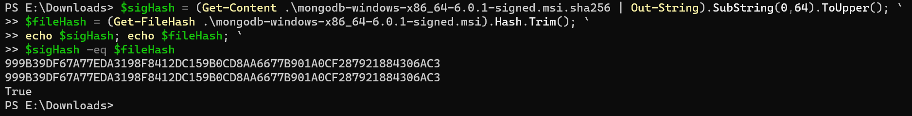
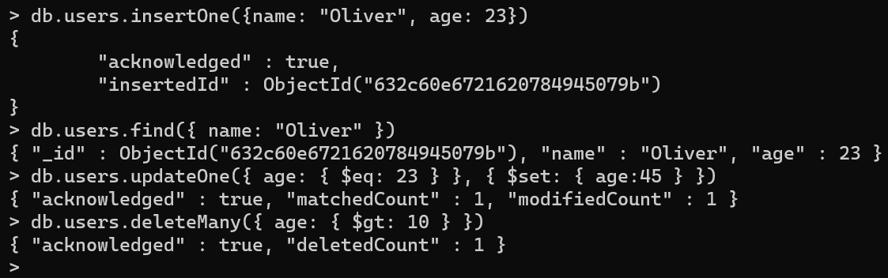
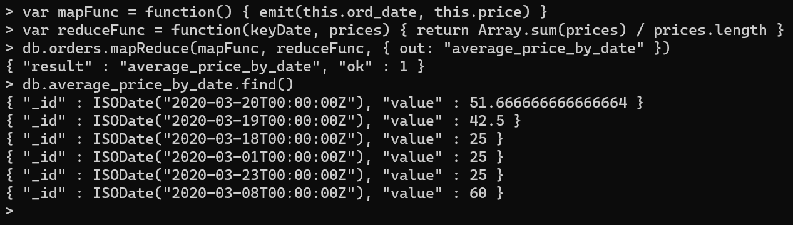

# DAT250: Software Technology Experiment Assignment 3

The first part of the assignment went very smoothly and I was able to download and verify MongoDB before installing it:

I could then perform all the CRUD operations:

And lastly I went through the Map-Reduce examples and created my own variant, finding the average price per order date:

I can see how such aggregation operations can be very useful to form and collect specific sets of data, although I did not find Map-Reduce to feel very intuitive to use. 

No pending issues remain.